### 2.4 微信读书-小说自动化

> **Selenium基本用法学习可看我这篇博客：**
[https://blog.csdn.net/weixin_39651356/article/details/122817263?ops_request_misc=%257B%2522request%255Fid%2522%253A%2522166240501616782244857781%2522%252C%2522scm%2522%253A%252220140713.130102334.pc%255Fblog.%2522%257D&request_id=166240501616782244857781&biz_id=0&utm_medium=distribute.pc_search_result.none-task-blog-2~blog~first_rank_ecpm_v1~rank_v31_ecpm-1-122817263-null-null.nonecase&utm_term=selenium&spm=1018.2226.3001.4450](https://blog.csdn.net/weixin_39651356/article/details/122817263?ops_request_misc=%257B%2522request%255Fid%2522%253A%2522166240501616782244857781%2522%252C%2522scm%2522%253A%252220140713.130102334.pc%255Fblog.%2522%257D&request_id=166240501616782244857781&biz_id=0&utm_medium=distribute.pc_search_result.none-task-blog-2~blog~first_rank_ecpm_v1~rank_v31_ecpm-1-122817263-null-null.nonecase&utm_term=selenium&spm=1018.2226.3001.4450)

#### 思路

```java
//1. 分析页面结构
问题：小说内容都使用<canvas>元素囊括，没在html页面发现有文件内容，问了前端同事，从页面上几乎不可拿到<canvas>里面的内容

//2. 其他方法
1. 方式1：分析数据请求接口：额，这个要耗费大量的时间，还不一定能分析的出大厂的接口，果断放弃
2. 方式2：模拟用户浏览器操作，截图、合并图片，最后利用第三方的pdf SDK（比如国外知名的itext、国内新势力easy-pdf）将这些图片合并成pdf（这正是selenium擅长的，模拟用户操作）
```


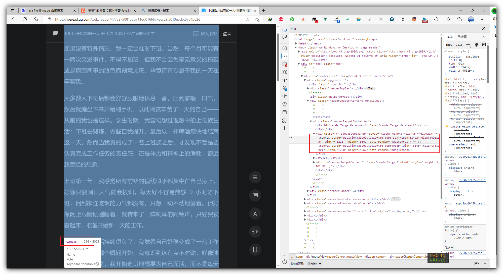


#### 代码

##### 代码-核心

> **仓库代码（觉得还行的话就顺便点个赞）：** https://gitee.com/changenen/lrctool


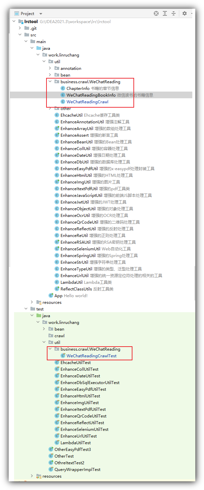


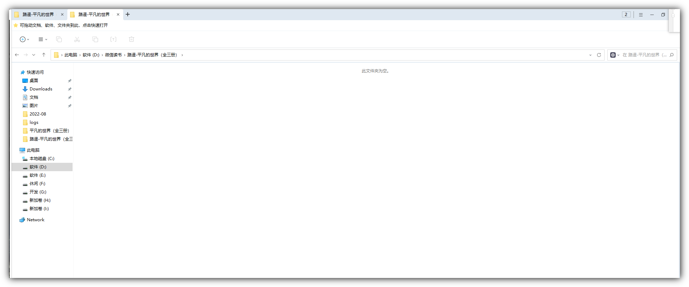


**WeChatReadingBookInfo.java - 书籍信息**
```java
@Data
@Builder
@Accessors(chain = true)
@NoArgsConstructor
@AllArgsConstructor
public class WeChatReadingBookInfo implements Serializable {

    /**
     * 作者
     */
    String author;

    /**
     * 书名
     */
    String name;

    /**
     * 章节列表
     */
    List<ChapterInfo> chapterInfos = CollUtil.newArrayList();

    private WeChatReadingBookInfo addChapterInfo(Integer chapterId, String chapterName) {
        chapterInfos.add(ChapterInfo.builder().name(chapterName).id(chapterId).build());
        return this;
    }

    public WeChatReadingBookInfo addChapterInfos(List<String> chapterNames) {
        CollUtil.forEach(CollUtil.emptyIfNull(chapterNames), (chapterName, index) -> {
            addChapterInfo(index + 1, chapterName);
        });
        return this;
    }

    /**
     * 设置章节所在的链接
     *
     * @param chapterName
     * @param chapterHyperlink
     * @return
     */
    public WeChatReadingBookInfo setChapterLink(String chapterName, String chapterHyperlink) {
        if (StrUtil.isAllNotBlank(chapterName, chapterHyperlink)) {
            chapterInfos.stream()
                    .filter(chapterInfo -> StrUtil.equals(chapterInfo.getName(), chapterName))
                    .findFirst()
                    .ifPresent(chapterInfo -> chapterInfo.setHyperlink(chapterHyperlink));
        }
        return this;
    }

    public ChapterInfo getChapterInfoByName(String chapterName) {
        return chapterInfos.stream()
                .filter(chapterInfo -> StrUtil.equals(chapterInfo.getName(), chapterName))
                .findFirst()
                .orElse(null);
    }


    /**
     * 获取对应章节的{@link ChapterInfo#id}属性字段值
     *
     * @param chapterName
     * @return 找不到则返回-1
     */
    public int getChapterId(String chapterName) {
        return chapterInfos.stream()
                .filter(chapterInfo -> StrUtil.equals(chapterInfo.getName(), chapterName))
                .findFirst()
                .map(ChapterInfo::getId)
                .orElse(-1);
    }


}

```


&emsp;
**ChapterInfo.java - 章节信息**
```java
@Data
@Builder
@Accessors(chain = true)
@NoArgsConstructor
@AllArgsConstructor
public class ChapterInfo implements Serializable {

    private static final long serialVersionUID = -197342711599464391L;
    Integer id;

    /**
     * 章节名字
     */
    String name;

    /**
     * 章节所属的链接
     */
    String hyperlink;

}

```


**WeChatReadingCrawl.java - 核心代码（代码中用到的我增强封装工具类，请自行到上面的仓库进行拷贝即可）**
```java
package work.linruchang.util.business.crawl.WeChatReading;

import cn.hutool.core.collection.CollUtil;
import cn.hutool.core.convert.Convert;
import cn.hutool.core.date.DateUtil;
import cn.hutool.core.exceptions.ExceptionUtil;
import cn.hutool.core.img.ImgUtil;
import cn.hutool.core.io.FileUtil;
import cn.hutool.core.io.IoUtil;
import cn.hutool.core.lang.Assert;
import cn.hutool.core.lang.Console;
import cn.hutool.core.thread.ThreadUtil;
import cn.hutool.core.util.NumberUtil;
import cn.hutool.core.util.ObjectUtil;
import cn.hutool.core.util.StrUtil;
import cn.hutool.json.JSONUtil;
import io.github.bonigarcia.wdm.WebDriverManager;
import lombok.Data;
import lombok.SneakyThrows;
import org.openqa.selenium.Keys;
import org.openqa.selenium.OutputType;
import org.openqa.selenium.WebDriver;
import org.openqa.selenium.WebElement;
import org.openqa.selenium.chrome.ChromeDriver;
import org.openqa.selenium.remote.RemoteWebDriver;
import work.linruchang.util.EnhanceImgUtil;
import work.linruchang.util.EnhanceSeleniumUtil;

import java.awt.*;
import java.awt.image.BufferedImage;
import java.io.ByteArrayInputStream;
import java.io.ByteArrayOutputStream;
import java.io.File;
import java.nio.charset.StandardCharsets;
import java.util.Arrays;
import java.util.Collections;
import java.util.List;
import java.util.concurrent.ConcurrentHashMap;

/**
 * @author LinRuChang
 * @version 1.0
 * @date 2022/09/03
 * @since 1.8
 **/
@Data
public class WeChatReadingCrawl {

    /**
     * 结果存储目录
     */
    File resultDir;

    /**
     * 操作日志
     */
    volatile File logOperatorFile;

    /**
     * 结果日志
     */
    volatile File logResultLogFile;


    /**
     * 日志文件:日志内容容器
     */
    final ConcurrentHashMap<File, List<String>> fileLogContentsMap = new ConcurrentHashMap<>();


    {
        // 异步监控日志
        // 操作日志
        ThreadUtil.execAsync(() -> {
            while (true) {
                if (getLogOperatorFile() != null) {
                    List<String> logContents = fileLogContentsMap.get(logOperatorFile);
                    if (CollUtil.isNotEmpty(logContents)) {
                        String firstLogContent = logContents.get(0);
                        Console.log(firstLogContent);
                        if (logOperatorFile != null) {
                            FileUtil.writeLines(Arrays.asList(StrUtil.format("{}  {}", DateUtil.now(), firstLogContent)), logOperatorFile, StandardCharsets.UTF_8, true);
                        }
                        logContents.remove(firstLogContent);
                    }
                }
            }
        }, true);

        // 爬取结果日志
        ThreadUtil.execAsync(() -> {
            while (true) {
                if (getLogResultLogFile() != null) {
                    List<String> resultContents = fileLogContentsMap.get(logResultLogFile);
                    if (CollUtil.isNotEmpty(resultContents)) {
                        String firstResultContent = resultContents.get(0);
                        logResultLogFile = FileUtil.touch(logResultLogFile);
                        List<String> logContent = Arrays.asList(StrUtil.format("============={}=================", DateUtil.now()), firstResultContent);
                        FileUtil.writeLines(logContent, logResultLogFile, StandardCharsets.UTF_8, true);
                        resultContents.remove(firstResultContent);
                    }
                }
            }
        }, true);
    }

    /**
     * 仅能设置一次当前爬取的结果目录
     *
     * @param resultDir
     */
    public WeChatReadingCrawl setResultDir(File resultDir) {
        if (this.resultDir == null) {
            this.resultDir = FileUtil.mkdir(resultDir);
            this.logOperatorFile = FileUtil.touch(FileUtil.file(resultDir, "logOperator.log"));
            this.logResultLogFile = FileUtil.touch(FileUtil.file(resultDir, "logResult.txt"));
        }
        return this;
    }


    /**
     * 扫二维码进行登录（微信读书连读前面几章节后就需要你扫码登录，故一开始你就应该扫码登录进行爬取）
     *
     * @param browser
     */
    @SneakyThrows
    public void scanQRCodeLogin(WebDriver browser) {
        Thread.sleep(500);

        // 1. 点击登录按钮
        EnhanceSeleniumUtil.clickElementByClassName(browser, "actionItem");

        // 2. 手机微信扫码登录
        saveOperatorLog("扫码登录开始");
        EnhanceSeleniumUtil.waitElementsDisappearByClassName(browser, "login_dialog_qrcode", (browser1, webElement) -> {
            saveOperatorLog("扫码登录成功");
        });

        Thread.sleep(2000);
    }

    /**
     * 获取书籍信息（作者、书名、章节）
     *
     * @param browser
     * @return
     */
    public WeChatReadingBookInfo getBookInfo(WebDriver browser) {

        // 1. 获取书籍名字
        String bookName = EnhanceSeleniumUtil.getContentByClassName(browser, "readerTopBar_title_link");


        // 2. 点击目录按钮 == 点击了才会加载全部章节的标题
        EnhanceSeleniumUtil.clickElementByXpath(browser, "//button[@class='readerControls_item catalog']");


        // 3. 获取书籍名、作者
        String bookAuthor = EnhanceSeleniumUtil.getContentByClassName(browser, "readerCatalog_bookInfo_author");
        if(this.resultDir == null) {
            setResultDir(FileUtil.file(StrUtil.format("D:\\微信读书\\\\{}-{}", bookAuthor, bookName)));
        }else {
            setResultDir(FileUtil.file(this.resultDir, StrUtil.format("{}-{}",bookAuthor, bookName)));
        }
        saveOperatorLog("书名：{}-{}", bookAuthor, bookName);

        // 4. 获取本小说全部章节标题
        List<String> bookAllChapterNames = EnhanceSeleniumUtil.getContentsByClassName(browser, "chapterItem_text");
        saveOperatorLog("<{}-{}>所有章节：{}", bookAuthor, bookName, bookAllChapterNames);
        saveOperatorLog("<{}-{}>共有章节数：{}", bookAuthor, bookName, bookAllChapterNames.size());

        // 5. 关闭侧边栏
        EnhanceSeleniumUtil.mouseMoveAndClick(browser, 20, 20);
        saveOperatorLog("关闭关闭侧边栏");


        // 6. 组装书籍信息
        return WeChatReadingBookInfo.builder()
                .name(bookName)
                .author(bookAuthor)
                .chapterInfos(CollUtil.newArrayList())
                .build()
                .addChapterInfos(bookAllChapterNames);

    }


    /**
     * 开始截图、滚动保存当前页面的微信小说内容
     *
     * @param browser  浏览器
     * @param bookInfo 书籍信息
     * @return
     */
    public Image crawlCurrentPageContent(RemoteWebDriver browser, WeChatReadingBookInfo bookInfo) {
        return crawlCurrentPageContent(browser, bookInfo, true);
    }


    /**
     * 开始截图、滚动保存当前页面的微信小说内容
     *
     * @param browser               浏览器
     * @param bookInfo              书籍信息
     * @param isSaveSegmentedImages 片段的图片是否需要保存（建议开启，用于排查截图、合并的问题）
     * @return 返回结果的图片是由多张片段图片合并而成
     */
    public Image crawlCurrentPageContent(RemoteWebDriver browser, WeChatReadingBookInfo bookInfo, boolean isSaveSegmentedImages) {

        // 滚动条置顶部（解决：由于用户历史查看，微信读书扫码登录会滚动至历史浏览位置）
        EnhanceSeleniumUtil.getElementByTagName(browser, "body").sendKeys(Keys.CONTROL, Keys.HOME);


        String targetResultDir = FileUtil.getAbsolutePath(getResultDir());

        // 设置章节链接信息
        String currentChapterName = EnhanceSeleniumUtil.getContentByClassName(browser, "readerTopBar_title_chapter");
        String currentChapterUrl = browser.getCurrentUrl();
        ChapterInfo chapterInfo = bookInfo.getChapterInfoByName(currentChapterName);
        bookInfo.setChapterLink(currentChapterName, currentChapterUrl);
        saveOperatorLog("\n");
        saveOperatorLog("【{}-{}】当前爬取：{}-{}", bookInfo.getName(), chapterInfo.getId(), currentChapterName, currentChapterUrl);


        Integer pageHeight = EnhanceSeleniumUtil.executeScriptToInt(browser, "return document.documentElement.scrollHeight");
        saveOperatorLog("页面高度：{}", pageHeight);

        Integer readerFooterHieght = EnhanceSeleniumUtil.getElementHeightByClassName(browser, "readerFooter");
        saveOperatorLog("readerFooter高度：{}", readerFooterHieght);


        Integer readerTopBarHieght = EnhanceSeleniumUtil.getElementHeightByClassName(browser, "readerTopBar");
        Integer readerTopBarWeight = EnhanceSeleniumUtil.getElementWidthByClassName(browser, "readerTopBar");
        saveOperatorLog("readerTopBar高度：{}", readerTopBarHieght);
        saveOperatorLog("readerTopBar宽度：{}", readerTopBarWeight);


        Integer windowHeight = EnhanceSeleniumUtil.executeScriptToInt(browser, "return window.innerHeight");
        Integer windowWeight = EnhanceSeleniumUtil.executeScriptToInt(browser, "return document.documentElement.clientWidth");
        saveOperatorLog("窗口高度：{}", windowHeight);
        saveOperatorLog("窗口宽度：{}", windowWeight);

        // 需要滚动的高度
        Integer sumScrollHeight = pageHeight - windowHeight;
        saveOperatorLog("需要滚动的高度：{}", sumScrollHeight);

        Integer eachScrollHeight = windowHeight - readerTopBarHieght;
        saveOperatorLog("每次滚动高度：{}", eachScrollHeight);

        BufferedImage sumImage = null;
        int srcollCount = (sumScrollHeight % eachScrollHeight) == 0 ? sumScrollHeight / eachScrollHeight : sumScrollHeight / eachScrollHeight + 1;
        // for (int currentScrollIndex = 0; currentScrollIndex < srcollCount + 1; currentScrollIndex++) {

        saveOperatorLog("此页滚动总次数：{}", srcollCount);
        for (int currentScrollIndex = 0; currentScrollIndex <= srcollCount; currentScrollIndex++) {
            saveOperatorLog("滚动开始：{}", currentScrollIndex);
            File screenshotAs = browser.getScreenshotAs(OutputType.FILE);
            BufferedImage currentScreenshot = EnhanceImgUtil.read(screenshotAs);
            BufferedImage cutCurrentScreenshot = null;  // 裁剪没用像素
            saveOperatorLog("截屏保存（原始）图片[{},{}]：{}", currentScreenshot.getWidth(), currentScreenshot.getHeight(), StrUtil.format("{}\\截图{}-{}-{}-裁剪前.png", targetResultDir, chapterInfo.getId(), currentChapterName, currentScrollIndex));

            // 用于图片裁剪的缩放 == 解决由于当前截屏的screenshotImageFile宽高不是windowHeight、windowWeight的宽高Bug
            Double zoomX = NumberUtil.div(Convert.toDouble(currentScreenshot.getWidth()), Convert.toDouble(windowWeight));
            Double zoomY = NumberUtil.div(Convert.toDouble(currentScreenshot.getHeight()), Convert.toDouble(windowHeight));
            saveOperatorLog("截屏图片的缩放比例：zoomX[{}]、zoomY[{}]", zoomX, zoomY);

            if (currentScrollIndex == srcollCount) { // 最后一张
                int remainingHeight = sumScrollHeight - (currentScrollIndex - 1) * eachScrollHeight;
                cutCurrentScreenshot = EnhanceImgUtil.toBufferedImage(EnhanceImgUtil.cut(currentScreenshot, new Rectangle((windowWeight - readerTopBarWeight) / 2, windowHeight - remainingHeight, readerTopBarWeight, remainingHeight > readerFooterHieght ? remainingHeight - readerFooterHieght : remainingHeight), zoomX, zoomY));
            } else {
                cutCurrentScreenshot = EnhanceImgUtil.toBufferedImage(EnhanceImgUtil.cut(currentScreenshot, new Rectangle((windowWeight - readerTopBarWeight) / 2, readerTopBarHieght, readerTopBarWeight, windowHeight - readerTopBarHieght), zoomX, zoomY));
            }

            if (isSaveSegmentedImages) {
                EnhanceImgUtil.write(currentScreenshot, new File(StrUtil.format("{}\\截图{}-{}-{}-裁剪前.png", targetResultDir, chapterInfo.getId(), currentChapterName, currentScrollIndex)));
                EnhanceImgUtil.write(cutCurrentScreenshot, new File(StrUtil.format("{}\\截图{}-{}-{}-裁剪后.png", targetResultDir, chapterInfo.getId(), currentChapterName, currentScrollIndex)));
            }
            saveOperatorLog("截屏保存（裁剪）图片[{},{}]：{}", cutCurrentScreenshot.getWidth(), cutCurrentScreenshot.getHeight(), StrUtil.format("{}\\截图{}-{}-{}-裁剪后.png", targetResultDir, chapterInfo.getId(), currentChapterName, currentScrollIndex));
            sumImage = EnhanceImgUtil.mergeImage(sumImage, cutCurrentScreenshot);

            if (currentScrollIndex != srcollCount) {
                EnhanceSeleniumUtil.scrollByVertical(browser, eachScrollHeight);
            }
            saveOperatorLog("滚动结束{}", currentScrollIndex);
        }

        ByteArrayOutputStream jpgImageByteArrayOutputStream = new ByteArrayOutputStream();
        ByteArrayInputStream resultPngByteArrayInputStream = new ByteArrayInputStream(ImgUtil.toBytes(sumImage, ImgUtil.IMAGE_TYPE_PNG));
        EnhanceImgUtil.convert(resultPngByteArrayInputStream, ImgUtil.IMAGE_TYPE_JPG, jpgImageByteArrayOutputStream);
        sumImage = EnhanceImgUtil.toImage(jpgImageByteArrayOutputStream.toByteArray());
        IoUtil.close(jpgImageByteArrayOutputStream);
        IoUtil.close(resultPngByteArrayInputStream);

        // 图片压缩以及保存
        File sourceResultImageFile = new File(StrUtil.format("{}\\合并截图{}-{}.jpg", targetResultDir, chapterInfo.getId(), currentChapterName));
        File targetCompressResultImageFile = new File(StrUtil.format("{}\\合并截图{}-{}-java压缩.jpg", targetResultDir, chapterInfo.getId(), currentChapterName));
        EnhanceImgUtil.write(sumImage, sourceResultImageFile);
        EnhanceImgUtil.compress(sourceResultImageFile, targetCompressResultImageFile, 0.3f);
        saveOperatorLog("保存滚动截屏后的合并：{}", StrUtil.format("{}\\合并截图{}-{}.jpg", targetResultDir, chapterInfo.getId(), currentChapterName));

        // 当前页面的小说合并之后的图片
        return ImgUtil.toImage(FileUtil.readBytes(targetCompressResultImageFile));
    }

    /**
     * 下一步操作（翻页OR直接结束）
     * <p>
     * 0正常翻页 -1书籍最后一章 -2不可继续爬取
     *
     * @param browser
     * @return
     */
    public Integer next(WebDriver browser) {
        // 5. 开始下一页OR结束自动化
        List<WebElement> footerButtons = EnhanceSeleniumUtil.getElementsByCssSelector(browser, ".readerFooter .readerFooter_button");
        if (CollUtil.size(footerButtons) == 0) {
            saveOperatorLog("自动化结束：正常、文章最后一章");
            return -1;
        } else if (CollUtil.size(footerButtons) > 1) {
            saveOperatorLog("自动化结束：不正常，当前书籍可能需要会员、或者单独购买才能进行后续的读取爬取");
            return -2;
        } else { // 下一页
            EnhanceSeleniumUtil.clickElementByClassName(browser, "readerFooter_button");
            // 翻页后暂停一秒让浏览器加载完成整个新的页面
            ThreadUtil.sleep(1000);
            return 0;
        }
    }


    /**
     * 保存最后爬取日志（追加模式）
     *
     * @param content 结果日志内容
     * @return
     */
    public File saveCrawlResultBookLog(String content, Object... args) {
        return saveCrawlResultBookLog(getLogResultLogFile(), content, args);
    }

    /**
     * 保存最后爬取日志（追加模式）
     *
     * @param content       日志内容
     * @param logResultFile 结果日志文件
     * @return
     */
    private File saveCrawlResultBookLog(File logResultFile, String content, Object... contentArgs) {
        if (logResultFile != null) {
            List<String> logContents = ObjectUtil.defaultIfNull(fileLogContentsMap.get(logResultFile), Collections.synchronizedList(CollUtil.newArrayList()));
            logContents.add(StrUtil.format(content, contentArgs));
            fileLogContentsMap.put(logResultFile, logContents);
        }
        return logResultFile;
    }


    /**
     * 操作日志
     *
     * @param content     日志内容
     * @param contentArgs 日志参数
     */
    public void saveOperatorLog(String content, Object... contentArgs) {
        saveOperatorLog(getLogOperatorFile(), content, contentArgs);
    }

    /**
     * 操作日志（打印） == 异步
     *
     * @param content         日志内容
     * @param logOperatorFile 操作日志文件
     */
    private void saveOperatorLog(File logOperatorFile, String content, Object... contentArgs) {
        if (content != null) {
            List<String> logContents = ObjectUtil.defaultIfNull(fileLogContentsMap.get(logOperatorFile), Collections.synchronizedList(CollUtil.newArrayList()));
            logContents.add(StrUtil.format(content, contentArgs));
            fileLogContentsMap.put(logOperatorFile, logContents);
        }
    }

    public void waitLogEmpty() {
        Console.log("\n等待程序记录本次爬取全部日志");
        while (!ObjectUtil.isAllEmpty(fileLogContentsMap.get(getLogOperatorFile()), fileLogContentsMap.get(getLogResultLogFile()))) {

        }
        Console.log("日志记录完毕");
    }


    /**
     * 开始爬取（打开页面即扫码登录）== 爬取全本小说
     *
     * @param weChatReadingBookUrl 微信读书的书籍URL
     * @return 爬取结果目录
     */
    public File startCrawl(String weChatReadingBookUrl) {
        return startCrawl(weChatReadingBookUrl, null, true);
    }

    /**
     * 开始爬取（打开页面即扫码登录）
     *
     * @param weChatReadingBookUrl 微信读书的书籍URL
     * @param planCrawlPageNum     计划爬取的页数，空则爬取直至书籍的最后一页
     * @return 爬取结果目录
     */
    public File startCrawl(String weChatReadingBookUrl, Integer planCrawlPageNum) {
        return startCrawl(weChatReadingBookUrl, planCrawlPageNum, true);
    }

    /**
     * 开始爬取
     *
     * @param weChatReadingBookUrl 微信读书的书籍URL
     * @param planCrawlPageNum     计划爬取的页数，空则爬取直至书籍的最后一页
     * @param openToQrCodeFlag     是否浏览器一开始打开页面即开始扫码  登录方便爬取免费书籍（如果不登录免费的书籍只给你看前面的几章后就提示你登录）
     * @return 爬取结果目录
     */
    public File startCrawl(String weChatReadingBookUrl, Integer planCrawlPageNum, boolean openToQrCodeFlag) {
        return startCrawl(weChatReadingBookUrl, planCrawlPageNum, openToQrCodeFlag, null);
    }

    /**
     * 开始爬取
     *
     * @param weChatReadingBookUrl 微信读书的书籍URL
     * @param planCrawlPageNum     计划爬取的页数，空则爬取直至书籍的最后一页
     * @param openToQrCodeFlag     是否浏览器一开始打开页面即开始扫码  登录方便爬取免费书籍（如果不登录免费的书籍只给你看前面的几章后就提示你登录）
     * @param resultDir     爬取的结果存放的目录（如果目录未创建则帮你创建，不设置则默认放到D盘的微信读书目录）
     * @return 爬取结果目录
     */
    public File startCrawl(String weChatReadingBookUrl, Integer planCrawlPageNum, boolean openToQrCodeFlag, File resultDir) {
        Assert.notBlank(weChatReadingBookUrl, "缺乏微信读书的小说链接");
        Assert.isTrue(planCrawlPageNum == null || planCrawlPageNum > 0, "计划爬取的页面要么置空，要么设置大于0");
        this.resultDir = resultDir;

        WebDriverManager.chromedriver().setup();
        ChromeDriver browser = new ChromeDriver();
        browser.get(weChatReadingBookUrl);

        // 浏览器放最大
        EnhanceSeleniumUtil.maximize(browser);


        // 2. 获取书籍信息
        WeChatReadingBookInfo bookInfo = getBookInfo(browser);

        // 1. 扫码登录
        if (openToQrCodeFlag) {
            scanQRCodeLogin(browser);
        }

        // 3. 当前章节的名字
        String currentChapterName = EnhanceSeleniumUtil.getContentByClassName(browser, "readerTopBar_title_chapter");


        int chapterIndex = bookInfo.getChapterId(currentChapterName);
        int endIndex = CollUtil.size(bookInfo.getChapterInfos());
        if (planCrawlPageNum != null) { // 含有计划爬取的页数
            endIndex = chapterIndex + (planCrawlPageNum - 1);
        }


        try {
            if (chapterIndex != -1) {
                do {
                    // 4. 爬取页面
                    crawlCurrentPageContent(browser, bookInfo);

                    // 5. 开始下一页OR结束自动化 == 非正常翻页直接结束
                    if (chapterIndex != endIndex) {
                        Integer stateCode = next(browser);
                        if (stateCode != 0) break;
                    }


                } while (++chapterIndex <= endIndex);
            }

        } catch (Exception e) {
            saveOperatorLog("发生异常：{}", ExceptionUtil.stacktraceToOneLineString(e));
        }


        // 6. 打印最后爬取的书籍信息、以及日志保存
        String bookInfoJson = JSONUtil.toJsonStr(bookInfo);
        saveOperatorLog("爬取的书籍信息：{}", bookInfoJson);
        saveCrawlResultBookLog(JSONUtil.formatJsonStr(bookInfoJson));


        // 7. 关闭浏览器（如果需要查找Bug可以不关这个浏览器）
        browser.close();


        // 8. 等待日志清空
        waitLogEmpty();

        return getResultDir();
    }


}

```


**WeChatReadingCrawl.java - 核心代码（代码中用到的我增强封装工具类，请自行到上面的仓库进行拷贝即可）**
```java
package work.linruchang.util.business.crawl.WeChatReading;

import cn.hutool.core.io.FileUtil;
import cn.hutool.core.lang.Console;
import org.junit.Test;

import java.io.File;

public class WeChatReadingCrawlTest{

    @Test
    public void testStartCrawl() {
        WeChatReadingCrawl weChatReadingCrawl = new WeChatReadingCrawl();
        //平凡的世界-版权信息-不扫码登录
        // File resultDir = weChatReadingCrawl.startCrawl("https://weread.qq.com/web/reader/18832880717cf0511881c78kc81322c012c81e728d9d180", 1,false);
        //平凡的世界-卷一-不扫码登录
        // File resultDir = weChatReadingCrawl.startCrawl("https://weread.qq.com/web/reader/18832880717cf0511881c78ka87322c014a87ff679a21ea", 2,false);
        //平凡的世界-卷一-第三章-不扫码登录
        // File resultDir = weChatReadingCrawl.startCrawl("https://weread.qq.com/web/reader/18832880717cf0511881c78k16732dc0161679091c5aeb1", 1,false);
        //平凡的世界-卷一-第三章-扫码登录
        File resultDir = weChatReadingCrawl.startCrawl("https://weread.qq.com/web/reader/18832880717cf0511881c78k16732dc0161679091c5aeb1", 2);
        Console.log("爬取结果目录：{}", FileUtil.getAbsolutePath(resultDir));
    }
}
```


**此动图所有动作完全由selenium接管进行自动触发扫码登录（需你到时拿手机微信进行扫码登录）、滚动、翻页**


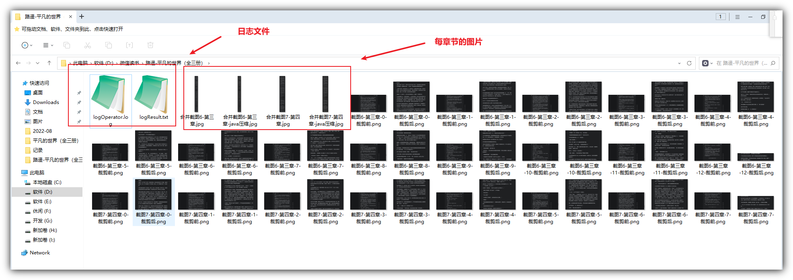


**部分日志**


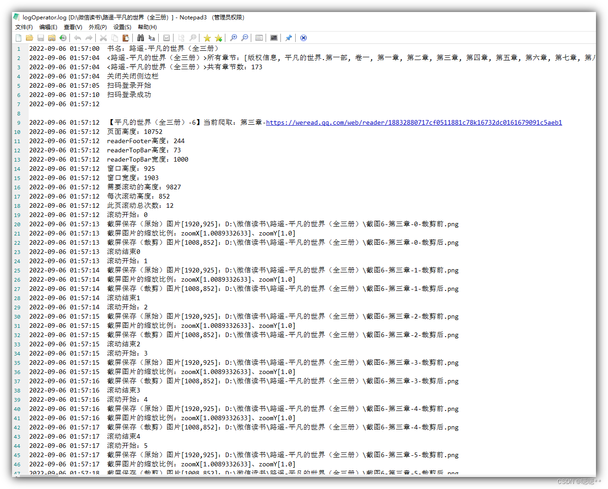


##### 代码-批量合并图片封装成册PDF


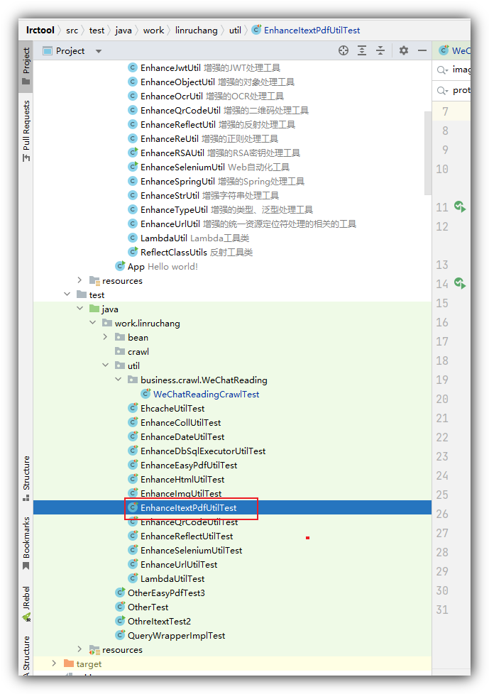

**EnhanceItextPdfUtilTest.java**
```java
import org.junit.Test;

import java.io.File;

public class EnhanceItextPdfUtilTest {

    @Test
    public void testImagesToPdfByDir2BBy1() {

        File soureDir = new File("D:\\微信读书\\路遥-平凡的世界（全三册）");
        File resultPdf = new File("D:\\微信读书\\路遥-平凡的世界（全三册）\\路遥-平凡的世界.pdf");

        EnhanceItextPdfUtil.imagesToPdfByDir(soureDir, pathname -> StrUtil.contains(FileUtil.getName(pathname), "java压缩"), (file1, file2) -> {

            String fileName1 = FileUtil.getName(file1);
            Integer indexNum1 = Convert.toInt(StrUtil.replace(StrUtil.subBefore(fileName1, "-", false), "合并截图", ""));

            String fileName2 = FileUtil.getName(file2);
            Integer indexNum2 = Convert.toInt(StrUtil.replace(StrUtil.subBefore(fileName2, "-", false), "合并截图", ""));

            return CompareUtil.compare(indexNum1, indexNum2);
        }, resultPdf);

    }
}
```


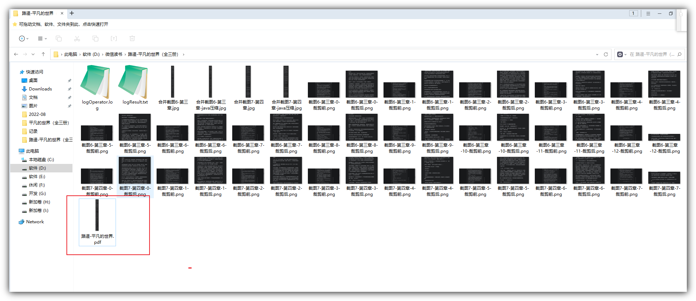


##### 【可选】工具-若有需要变成可复制的文本文件使用ABBYY FineReader 15内置的本地OCR转成其他文本文件


> **注意：** 不差钱的金主可以使用第三方的收费OCR-API进行图片识别转文件即可


&emsp;


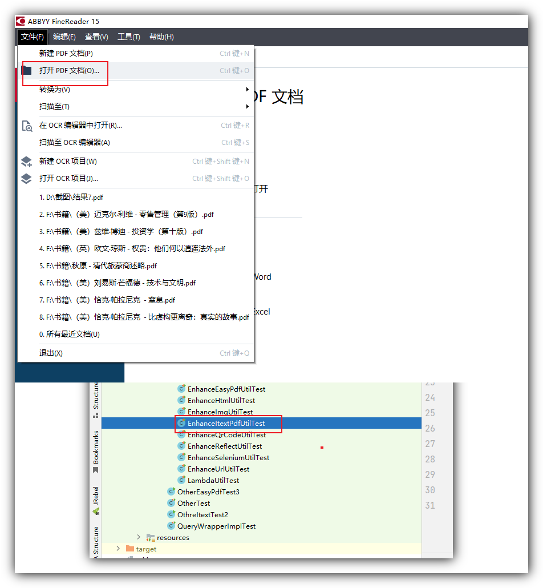

&emsp;


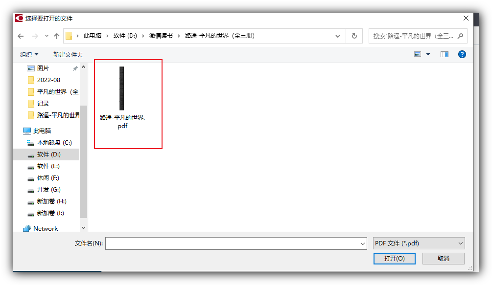

&emsp;


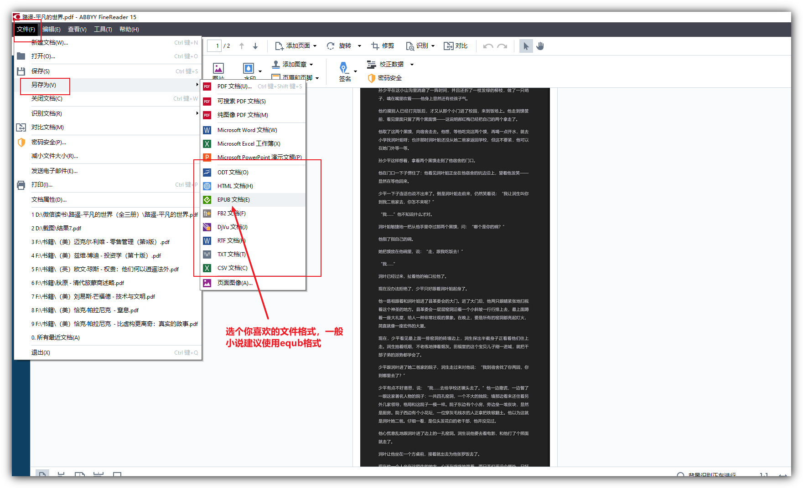
&emsp;
**这步如果你pdf文件大的话，很可能会花费大量时间进行OCR文件识别解析，一般250M打上的文件，会解析个10多分钟吧（主要看电脑性能）**


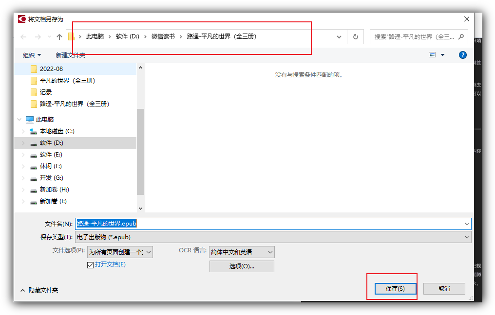

&emsp;


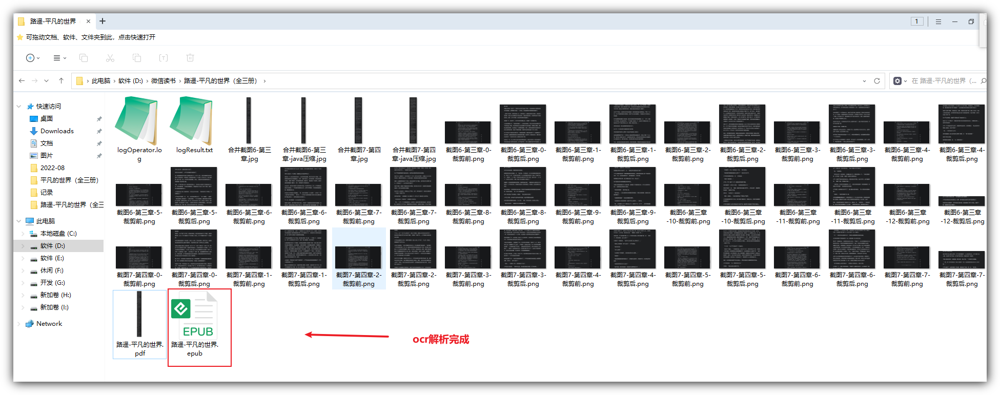
&emsp;
**用金山的稻壳阅读器查看equb文件-可见已经转成可复制文本的文件格式**


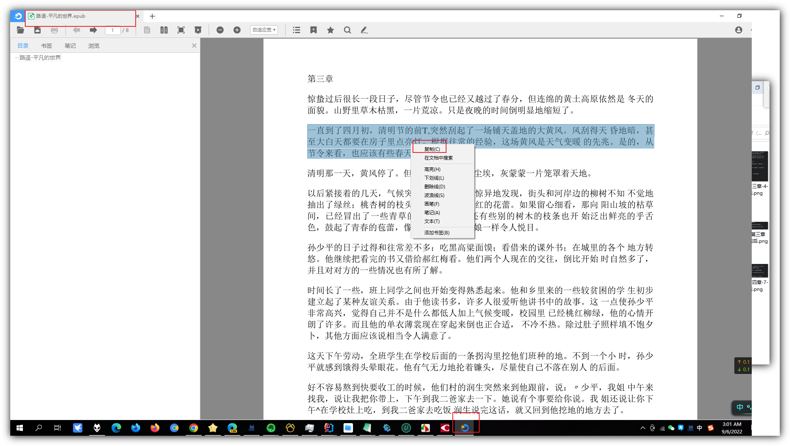